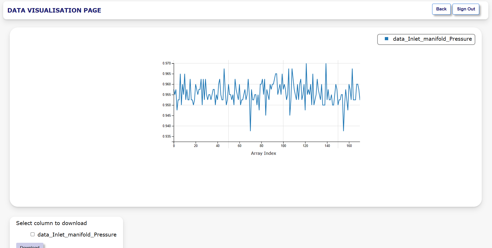

# STORAGE AND DISPLAY OF SUSTAINABLE DATA IN DATABASE SYSTEM FOR ONLINE DISPLAY

  

  
    

## Table of Contents

- [STORAGE AND DISPLAY OF SUSTAINABLE DATA IN DATABASE SYSTEM FOR ONLINE DISPLAY](#storage-and-display-of-sustainable-data-in-database-system-for-online-display)
  - [Table of Contents](#table-of-contents)
  - [Final Year Project](#final-year-project)
  - [About the Project](#about-the-project)
  - [Contributor](#contributor)

## Final Year Project

This project was conceived as the final year dissertation for Computer Engineering at the University of Greenwich. Its primary objective is to extract data from database using PHP and visualize it on the front end using the D3 JavaScript library.

## About the Project
 In this project, MySQL is utilized as the database, offering an efficient means of data storage across various environments. However, for further development, alternative databases can be seamlessly integrated. The project repository also includes the dataset utilized, providing users with accessible data for experimentation and expansion.

HTML, CSS, and JavaScript form the core of the project's client-side development, facilitating the creation of an engaging and interactive website interface. Moreover, data visualization functionalities are achieved using the D3 library, renowned for its comprehensive data handling capabilities within the JavaScript domain. Currently, the project offers a single visualization option in the form of a line graph. However, users are encouraged to extend the visualization capabilities by incorporating additional types of visualizations alongside the existing line graph.

Finally, PHP was employed for server-side development, enabling database access and security measures, thereby transforming the project into a comprehensive full-stack web development endeavor. The Agile Software Development methodology was embraced, prioritizing iterative development processes. Additionally, users have the flexibility to modify the backend according to their requirements.

## Contributor
1. [Samir Shrestha](https://github.com/sameyr)

    LinkedIn Profile: [LinkedIn](https://www.linkedin.com/in/sameyr/)

